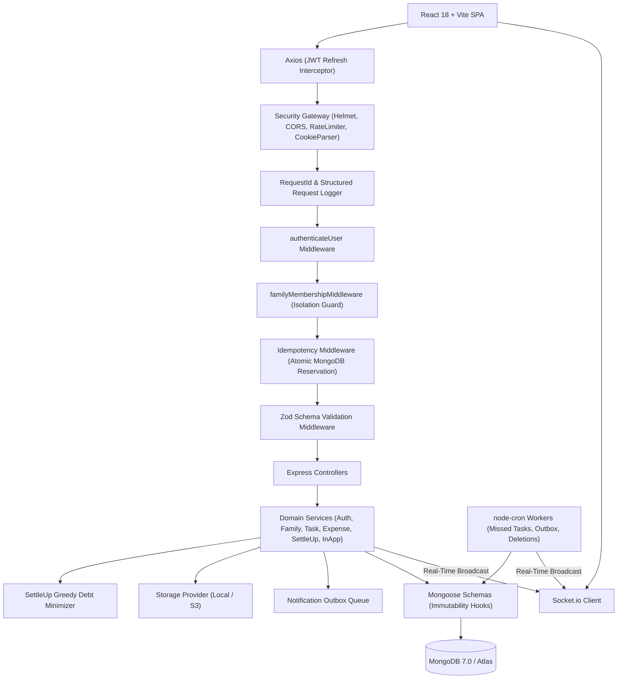

# SaathCare 🏥

> **Shared Elder-Care Coordination and Cost-Ledger Platform**  
> *Built for geographically distributed families caring jointly for an aging parent.*

[](https://github.com/saurabhg4356/saathcare/actions/workflows/ci.yml)
[](LICENSE)
[](https://nodejs.org/)
[](https://react.dev/)
[](https://www.mongodb.com/)
[](https://www.docker.com/)

---

## 1. Project Overview

SaathCare is a production-ready, full-stack web platform designed to solve the two biggest points of failure for siblings caring jointly for an aging parent: **asymmetric care coordination** and **opaque expense sharing**.

When family members live in different cities or time zones, elder care often dissolves into scattered WhatsApp chats, forgotten medication schedules, and awkward financial friction. SaathCare establishes a transparent, collaborative hub with:
- Structured duty assignments and calendar schedules
- Automated missed-duty detection and alerts
- An immutable, append-only financial ledger with paise precision
- An $O(N \log N)$ greedy debt-minimization settlement engine
- Real-time cross-client updates via WebSockets (Socket.io)
- Enterprise-grade security, idempotency, and transactional notification outboxes

---

## 2. Problem Statement

1. **Care Burden Asymmetry**: Sibling caregivers lack an objective, shared log of daily elder-care duties (insulin doses, blood pressure monitoring, doctor consultations). Critical duties are dropped or duplicated.
2. **Financial Opacity**: Medical emergencies, diagnostic scans, caregiver salaries, and medicine purchases are tracked across chat threads or spreadsheets, leading to disputed splits and delayed settlements.
3. **Loss of Immutability**: Traditional CRUD systems allow users to edit or delete logged expenses, destroying the audit trail and eroding family trust.

---

## 3. The SaathCare Solution

* **Shared Accountability**: Every family member has equal permissions to create duties, mark tasks complete, log medical expenses, and view settlements.
* **Immutable Double-Entry Ledger**: Database-level pre-save hooks strictly forbid updating or deleting financial records. Corrections must be logged as offsetting reversing entries.
* **Paise Precision**: All financial arithmetic runs in integer minor units (1 INR = 100 paise), eliminating IEEE 754 floating-point drift.
* **Greedy Settlement Engine**: Minimizes the number of peer-to-peer transfers required to square all sibling debts.

---

## 4. Key Features

- **Multi-Group Family Coordination**: Users can belong to multiple family groups. Care recipients are modeled directly within each care team.
- **Duty & Task Management**: Explicit duty assignment, priority levels, category tags, due date countdowns, and tamper-proof task history.
- **Task Calendar View**: Visual month calendar showing scheduled duties, statuses, and one-click completion.
- **Automated Missed-Task Detection**: Background cron job (`missedTaskDetector.job.js`) automatically transitions overdue pending tasks to `MISSED` and alerts the family.
- **Real-Time Live Sync (Socket.io)**: Instant UI synchronization across all family devices for task completions, missed duties, new expenses, reversals, and member joins.
- **In-App Notification Center**: Real-time notification drawer with unread badges, timestamp formatting, and mark-as-read controls.
- **Append-Only Immutable Expense Ledger**: Strict write-only ledger where mutations throw database-level exceptions. Corrections append reversing records.
- **Receipt & Bill Attachments**: Multer-backed file upload pipeline supporting images/PDFs up to 5MB with signed URL access and an in-app receipt preview modal.
- **Paise Precision Financial Engine**: Exact integer minor unit math guarantees $\sum \text{splits} = \text{total}$.
- **Greedy Debt-Minimization Engine**: Computes the optimal minimal repayment matrix between debtors and creditors in $O(N \log N)$ time.
- **Strict Family Boundary Security**: `familyMembershipMiddleware` ensures complete tenant isolation; members can only access their authorized family data.
- **Enterprise Authentication**: Short-lived JWT access tokens (15m), refresh token rotation with SHA-256 hashing, HTTP-only cookies, password recovery, and email verification.
- **Financial Idempotency Middleware**: `X-Idempotency-Key` prevents duplicate ledger charges during network retries with atomic reservations and 24-hr TTL caching.
- **Transactional Notification Outbox**: Decoupled email queue (`notificationOutbox.job.js`) with exponential backoff eliminating the dual-write problem.
- **Distributed Cron Locking**: Cluster-wide lease management (`DistributedLock`) preventing duplicate background jobs across multi-replica deployments.
- **Contact Us & Inquiry System**: Public contact form with Zod validation, honeypot anti-spam defense, and IP rate limiting.
- **Dual Light / Dark Theme**: Clean CSS custom property design system supporting instant light/dark mode toggling and OS preference detection.
- **Interactive Onboarding Tour**: 5-step guided walkthrough for new caregivers with progress indicators and skip support.
- **Real-Time Usage Statistics**: Public metrics dashboard endpoint (`/api/stats`) displaying verified platform usage with 15-minute in-memory caching.
- **GDPR-Compliant Account Deletion**: 3-day grace period with full PII anonymization while preserving financial ledger auditability.

---

## 5. Architecture



---

## 6. Technology Stack

### Frontend
- **Framework**: React 18 (`react 18.2.0`, `react-dom 18.2.0`)
- **Build Tool**: Vite `5.2.8`
- **Routing**: React Router DOM `6.22.3` (with `React.lazy` code-splitting)
- **HTTP Client**: Axios `1.6.8` with automatic 401 refresh token interceptor
- **Real-Time Client**: Socket.io-client `4.7.5`
- **Icons**: Lucide React `0.368.0`
- **Styling**: Vanilla CSS Design System with CSS Custom Properties, glassmorphism, responsive grids, and dark/light themes

### Backend
- **Runtime**: Node.js (ES Modules, `node >= 18.0.0`)
- **Framework**: Express.js `4.19.2`
- **Database & ODM**: MongoDB 7.0 / Atlas with Mongoose `8.3.1`
- **Real-Time Server**: Socket.io `4.7.5`
- **Validation**: Zod `3.22.4`
- **Authentication**: JWT (`jsonwebtoken 9.0.2`), `bcryptjs 2.4.3`, SHA-256 token hashing
- **Job Scheduler**: `node-cron 3.0.3`
- **Email Infrastructure**: Nodemailer `10.0.10` with Gmail OAuth2 & SMTP provider abstraction
- **File Uploads**: Multer `2.4.0` with MIME whitelist
- **Security**: Helmet `7.1.0`, CORS `2.8.5`, `express-rate-limit 7.2.0`, `cookie-parser 1.4.6`

### DevOps & Tooling
- **Test Runner**: Vitest `1.5.0` & Supertest `6.3.4` (16 test suites, 57 automated tests)
- **Containerization**: Multi-stage Dockerfiles (`Dockerfile.server`, `Dockerfile.client`) & Docker Compose
- **CI/CD**: GitHub Actions (`ci.yml`, `deploy.yml`)
- **Deployment**: Vercel (Frontend Edge) + Render (Backend Web Service) + MongoDB Atlas (Database)

---

## 7. Monorepo Project Structure

```text
SaathCare/
├── .github/
│   └── workflows/
│       ├── ci.yml                 # Matrix testing (Node 20, 22) & client build
│       └── deploy.yml             # Render deploy hook & Vercel deployment
├── client/                        # React 18 + Vite frontend
│   ├── public/                    # Favicon and static assets
│   ├── src/
│   │   ├── components/
│   │   │   ├── calendar/          # TaskCalendar month view
│   │   │   ├── common/            # ContactForm, NotificationDrawer, OnboardingTour, ThemeToggle, ErrorBoundary
│   │   │   ├── dashboard/         # CareInfoCard, CategoryExpenseAnalytics
│   │   │   ├── layout/            # AppLayout, Navbar (responsive mobile drawer)
│   │   │   └── modals/            # AddExpenseModal, ReverseExpenseModal, ReceiptPreviewModal, CreateTaskModal, etc.
│   │   ├── context/               # AuthContext, FamilyContext, SocketContext, ThemeContext
│   │   ├── hooks/                 # Custom React hooks (useAuth, useFamily, useTasks, useExpenses, useSocket)
│   │   ├── pages/                 # Landing, Login, Register, Dashboard, Tasks, Expenses, Settlements, FamilyDetail, etc.
│   │   ├── routes/                # AppRoutes, ProtectedRoute
│   │   ├── services/              # API services (api, auth, family, task, expense, contact, stats, notification)
│   │   ├── socket/                # Socket.io client connector
│   │   ├── utils/                 # Currency (paise), dates, constants, UUID
│   │   ├── index.css              # Design system stylesheet (Dark/Light tokens)
│   │   └── main.jsx
│   ├── vite.config.js             # Vite configuration with proxy
│   └── package.json
├── server/                        # Node.js Express backend
│   ├── src/
│   │   ├── config/                # Database connection, env validation (Zod), structured logger
│   │   ├── constants/             # Task statuses, split types, socket events, invite statuses
│   │   ├── controllers/           # Auth, Family, Task, Expense, Contact, Stats, Notification, Health controllers
│   │   ├── jobs/                  # missedTaskDetector, notificationOutbox, accountDeletion cron workers
│   │   ├── middleware/            # Auth, familyMembership, idempotency, rateLimit, requestId, requestLogger, upload, validation, error
│   │   ├── models/                # User, FamilyGroup, Invite, Task, RotationRule, ExpenseLedger, Notification, Outbox, IdempotencyKey, etc.
│   │   ├── routes/                # Health, auth, family, task, expense, contact, stats, notification route files
│   │   ├── services/              # Domain services, email providers, storage providers, SettleUp algorithm
│   │   ├── sockets/               # Socket.io server, authentication handshake, room emitter
│   │   ├── utils/                 # ApiResponse, ApiError, crypto helpers, distributedLock
│   │   └── validators/            # Zod validation schemas
│   ├── tests/                     # 16 Vitest test suites (14 unit + 2 integration)
│   └── package.json
├── docker/                        # Dockerfile.server, Dockerfile.client, nginx.conf
├── docs/                          # In-depth architectural & operational documentation
│   ├── api.md                     # Comprehensive REST API endpoint reference
│   ├── architecture.md            # Clean layered architecture & data flow
│   ├── database.md                # Database schemas & data dictionary
│   ├── security.md                # Threat mitigation matrix & cryptographic protocols
│   ├── testing.md                 # Test matrix & QA strategy
│   ├── deployment.md              # Cloud deployment guide (Render, Vercel, Atlas)
│   ├── production-hardening.md    # Production hardening patterns (Phases B–O)
│   ├── website-addons.md          # Website add-ons specification (Phases 1–19)
│   └── interview-notes.md         # Senior engineering interview guide (Q1–Q22)
├── docker-compose.yml             # Full-stack local Docker environment
├── .env.example                   # Configuration blueprint (no secrets)
├── package.json                   # Root monorepo workspace scripts
└── README.md
```

---

## 8. Authentication & Security

- **JWT Access & Refresh Token Rotation**:
  - Access token: 15-minute lifetime, transmitted in `Authorization: Bearer <token>`.
  - Refresh token: 7-day lifetime, stored in `HttpOnly`, `Secure`, `SameSite=none` cookie.
  - Refresh Token Rotation: Every refresh request invalidates the old SHA-256 hash in the database. Token reuse immediately revokes all user sessions.
- **Cryptographic Hashing**:
  - Passwords: `bcryptjs` with work factor 12.
  - Verification & Reset Tokens: Stored only as SHA-256 hashes (`crypto.createHash('sha256')`).
- **Family Tenant Isolation**:
  - `familyMembershipMiddleware` queries MongoDB on every family-scoped route to ensure `req.user._id` is an active member. Cross-family URL tampering is aborted with `403 Forbidden`.
- **Anti-Enumeration Protection**:
  - Registration, login, password recovery, and email verification endpoints return consistent responses to prevent user existence probing.
- **Input Sanitization**:
  - All incoming request bodies and query parameters are strictly validated with Zod schemas. Unexpected fields are stripped.

---

## 9. Core User Flow

```text
1. Register / Login
      ↓
2. Email Verification (Verification link sent via Notification Outbox)
      ↓
3. Interactive Onboarding Tour (5-step guide introducing duties, ledger, and settlements)
      ↓
4. Create Family Group (Define care recipient profile, emergency notes)
      ↓
5. Invite Siblings (Generate secure 64-character token invitation links)
      ↓
6. Assign Care Duties (Set due dates, priorities, and medication reminders)
      ↓
7. Complete Duties / Missed Task Sweeper (Live updates via Socket.io)
      ↓
8. Log Medical Expenses (Upload receipts, choose equal or custom splits)
      ↓
9. Compute SettleUp Matrix ($O(N log N) greedy debt-minimization transfers)
```

---

## 10. Task Management & Missed Duty Sweeper

- Tasks support three immutable states: `PENDING`, `COMPLETED`, `MISSED`.
- State Machine Safeguard: A Mongoose pre-save hook blocks transitions out of terminal states (`COMPLETED` $\to$ `PENDING` and `MISSED` $\to$ `PENDING` are strictly rejected).
- Background Cron Job: `missedTaskDetector.job.js` runs periodically (default: every 5 minutes), atomically transitions overdue pending tasks to `MISSED`, and emits `task:missed` over Socket.io.
- Task Calendar View: Month-grid view (`TaskCalendar.jsx`) rendering duty pills, status indicators, and direct completion actions.

---

## 11. Expense Ledger & Greedy Settlement Engine

### Minor-Unit Paise Arithmetic
- To avoid IEEE 754 binary floating-point drift (`0.1 + 0.2 = 0.30000000000000004`), all money is stored in integer paise:
  $$\text{₹1,500.50} = 150050\text{ paise}$$
- Exact Split Invariant:
  $$\sum_{i=1}^{k} \text{splitAmong}[i].\text{amountPaise} = \text{amountPaise}$$

### Append-Only Immutability
- Mongoose middleware strictly blocks `updateOne`, `findOneAndUpdate`, and `deleteOne` operations on `ExpenseLedger`.
- Erroneous entries are corrected via offsetting reversal records (`isReversal: true`, `originalEntryId: targetId`).
- The settlement engine automatically neutralizes pairs of original and reversal entries.

### Greedy Debt-Minimization Algorithm ($O(N \log N)$)
1. Calculate net balance for each member: $\text{net} = \text{totalPaid} - \text{totalOwed}$.
2. Partition members into **creditors** ($\text{net} > 0$) and **debtors** ($\text{net} < 0$).
3. Sort creditors descending by credit; sort debtors descending by debt.
4. Greedily match the largest debtor with the largest creditor for $\min(\text{credit}, \text{debt})$.
5. Updates balances until all net positions reach 0.

---

## 12. Real-Time Features (Socket.io)

- **Handshake Verification**: Sockets authenticate during connection using JWT access tokens.
- **Room Isolation**: Sockets join family rooms (`family:<familyGroupId>`) and user rooms (`user:<userId>`).
- **Events Broadcasted**:
  - `task:created`, `task:completed`, `task:missed`
  - `expense:added`, `expense:reversed`
  - `member:joined`
  - `notification:new`
- **Fallback Resilience**: Clients auto-reconnect with exponential backoff and refetch authoritative state from REST APIs on reconnection.

---

## 13. Notifications & Outbox Pattern

- **Decoupled Outbox Queue**: Critical actions insert notification records into `NotificationOutbox` with status `PENDING` within the database transaction.
- **Background Worker**: `notificationOutbox.job.js` polls batches every 10 seconds, applies exponential backoff on failure ($2^{\text{attempts}} \times 10\text{s}$, max 3600s), and transitions items to `SENT` or `FAILED`.
- **In-App Notification Center**: User-scoped drawer (`NotificationDrawer.jsx`) displays instant unread counts and updates live via `notification:new`.

---

## 14. Contact Us, Themes & Add-ons

- **Contact Us**: Accessible form with input validation, anti-spam honeypot (`website_url`), and rate limiting (5 inquiries/15m).
- **Dual Light / Dark Theme**: Clean theme switcher (`ThemeToggle.jsx`) updating `:root` and `[data-theme="light"]` CSS variables with smooth transitions.
- **Usage Statistics**: `/api/stats` endpoint providing cached, real-data metrics (active families, verified caregivers, completed duties, tracked expenses).
- **Interactive Tour Guide**: 5-step onboarding walkthrough for first-time caregivers (`OnboardingTour.jsx`).
- **GDPR Account Deletion**: 3-day cancelable grace period followed by automated PII anonymization to `"Former Member"` without deleting financial ledger records.

---

## 15. Testing

The SaathCare test suite consists of **16 test files** (14 unit + 2 integration) and **57 automated tests** running in **Vitest**:

```bash
# Run all server tests
npm test

# Run tests with coverage
npm --prefix server run test:coverage

# Run tests in watch mode
npm --prefix server run test:watch
```

### Test Coverage Highlights:
- **Settlement Engine**: 2-member, 3-member, multi-creditor/debtor, custom splits, zero balances, remainder paise, and reversal neutralization.
- **Ledger Immutability**: Database rejection of `updateOne`, `findOneAndUpdate`, `deleteOne`, etc.
- **Task State Machine**: Rejection of illegal transitions out of `COMPLETED` and `MISSED`.
- **Authentication**: JWT verification, SHA-256 refresh token hashing, and Zod validator rejections.
- **Notification Outbox**: Enqueue, dispatch, retry backoff, and max attempt handling.
- **Idempotency**: Cached response replay and concurrent conflict prevention.
- **Account Deletion**: 3-day grace period logic and anonymization sanitization.
- **Probes**: Supertest assertions on `/health` (liveness) and `/ready` (readiness).

---

## 16. Docker Deployment

### Full-Stack Docker Compose (Zero-Config)
Run MongoDB, the Node.js backend, and the Nginx-hosted client in isolated containers:

```bash
docker compose up -d --build
```

- **Frontend Client**: `http://localhost:3000`
- **Backend API**: `http://localhost:5000`
- **Health Check**: `http://localhost:5000/health`
- **Readiness Check**: `http://localhost:5000/ready`
- **MongoDB**: `localhost:27017`

---

## 17. CI/CD Pipeline

SaathCare uses **GitHub Actions** for continuous integration and automated deployment:

1. **Continuous Integration (`.github/workflows/ci.yml`)**:
   - Triggers on every push and pull request to `main`.
   - Runs backend test suites across **Node.js 20.x and 22.x** (`npm run test:server`).
   - Executes the frontend production build (`npm run build:client`).
2. **Production Deployment (`.github/workflows/deploy.yml`)**:
   - Triggers on push to `main` or manual `workflow_dispatch`.
   - Triggers the Render backend deployment webhook (`RENDER_DEPLOY_HOOK_URL`).
   - Deploys the frontend to Vercel Edge (`VERCEL_TOKEN`).

---

## 18. Environment Variables

Create `.env` in the `server/` directory (or root) based on `.env.example`:

| Variable | Description | Default / Example |
| :--- | :--- | :--- |
| `NODE_ENV` | Application environment | `development` / `production` |
| `PORT` | Backend HTTP port | `5000` |
| `CLIENT_URL` | Allowed frontend origin for CORS | `http://localhost:5173` |
| `MONGODB_URI` | MongoDB connection URI | `mongodb://127.0.0.1:27017/saathcare` |
| `JWT_ACCESS_SECRET` | Secret key for access tokens | Secure random 64-char string |
| `JWT_REFRESH_SECRET` | Secret key for refresh tokens | Secure random 64-char string |
| `JWT_ACCESS_EXPIRY` | Access token lifespan | `15m` |
| `JWT_REFRESH_EXPIRY_DAYS` | Refresh token lifespan (days) | `7` |
| `COOKIE_SECURE` | Enable secure cookies in prod | `false` (dev) / `true` (prod) |
| `COOKIE_SAME_SITE` | Cross-origin cookie policy | `lax` (dev) / `none` (prod) |
| `COOKIE_DOMAIN` | Optional cookie domain | Optional |
| `RATE_LIMIT_WINDOW_MS` | Rate limit window in ms | `900000` (15 min) |
| `RATE_LIMIT_MAX_REQUESTS`| Max requests per window | `200` |
| `MISSED_TASK_CRON_SCHEDULE` | Cron schedule for task sweeper | `*/5 * * * *` |
| `MISSED_TASK_JOB_ENABLED` | Enable missed task cron worker | `true` |
| `EMAIL_PROVIDER` | Active email transport | `mock` / `smtp` / `gmail` |
| `EMAIL_FROM` | Sender email address | `SaathCare <noreply@saathcare.org>` |
| `STORAGE_PROVIDER` | Receipt file storage provider | `local` / `s3` |
| `AWS_S3_BUCKET` | AWS S3 bucket name | Optional |
| `AWS_REGION` | AWS region | `ap-south-1` |

---

## 19. Local Development Quickstart

### Prerequisites
- Node.js `>= 18.0.0` and npm
- Local MongoDB running at `mongodb://127.0.0.1:27017` (or MongoDB Atlas URI)

### Step-by-Step Setup:

1. **Clone the repository**:
   ```bash
   git clone https://github.com/saurabhg4356/saathcare.git
   cd saathcare
   ```

2. **Configure Environment Variables**:
   ```bash
   cp .env.example .env
   ```

3. **Install Workspace Dependencies**:
   ```bash
   npm install
   ```

4. **Run Automated Test Suites**:
   ```bash
   npm test
   ```

5. **Start Development Servers**:
   ```bash
   # Terminal 1: Backend API & Socket Server (Port 5000)
   npm run dev:server

   # Terminal 2: Frontend Client (Port 5173)
   npm run dev:client
   ```

6. Open your browser at `http://localhost:5173`.

---

## 20. Production Deployment

### Production Topology:
```text
React / Vite Frontend (Vercel Global CDN)
            │
            ▼ (HTTPS / WSS with Cross-Origin Credentials)
Node.js Express Backend (Render Web Service)
            │
            ▼
MongoDB Atlas (Managed Database Replica Set)
```

- **Backend (Render)**:
  - Root Directory: `server` (or repository root with `npm --prefix server start`)
  - Build Command: `npm install`
  - Start Command: `node server/src/server.js` (or `npm --prefix server start`)
  - Environment: `NODE_ENV=production`, `COOKIE_SAME_SITE=none`, `COOKIE_SECURE=true`, `CLIENT_URL=https://<your-vercel-domain>`
- **Frontend (Vercel)**:
  - Root Directory: `client`
  - Framework Preset: `Vite`
  - Build Command: `npm run build`
  - Output Directory: `dist`
  - Environment: `VITE_API_URL=https://<your-render-domain>`

---

## 21. Live Application

* **Frontend Application**: `https://saathcare.vercel.app` *(or custom production domain)*
* **Backend API Gateway**: `https://saathcare-server.onrender.com`
* **Liveness Probe**: `https://saathcare-server.onrender.com/health`
* **Readiness Probe**: `https://saathcare-server.onrender.com/ready`

---

## 22. Documentation Sitemap

For comprehensive architectural specifications, data dictionaries, and engineering interview preparation, explore the `docs/` directory:

- [docs/architecture.md](file:///c:/SaathCare/docs/architecture.md) — Clean layered architecture, Socket.io rooms, cron jobs, and data flow.
- [docs/database.md](file:///c:/SaathCare/docs/database.md) — Mongoose schemas, compound indexes, minor-unit paise policy, and immutability rules.
- [docs/api.md](file:///c:/SaathCare/docs/api.md) — Complete REST API endpoint reference and JSON envelopes.
- [docs/security.md](file:///c:/SaathCare/docs/security.md) — Threat mitigation matrix, token rotation, family isolation, and cryptographic protocols.
- [docs/testing.md](file:///c:/SaathCare/docs/testing.md) — Vitest test suites, test matrix, and QA coverage criteria.
- [docs/deployment.md](file:///c:/SaathCare/docs/deployment.md) — Step-by-step production deployment for Render, Vercel, and Atlas.
- [docs/production-hardening.md](file:///c:/SaathCare/docs/production-hardening.md) — Advanced hardening patterns: outbox pattern, idempotency, and distributed locking.
- [docs/website-addons.md](file:///c:/SaathCare/docs/website-addons.md) — Specification of website add-ons & product enhancements (Phases 1–19).
- [docs/interview-notes.md](file:///c:/SaathCare/docs/interview-notes.md) — Senior software engineering interview questions (Q1–Q22) and architectural trade-offs.

---

## 23. License

This project is licensed under the MIT License — see the [LICENSE](LICENSE) file for details.
