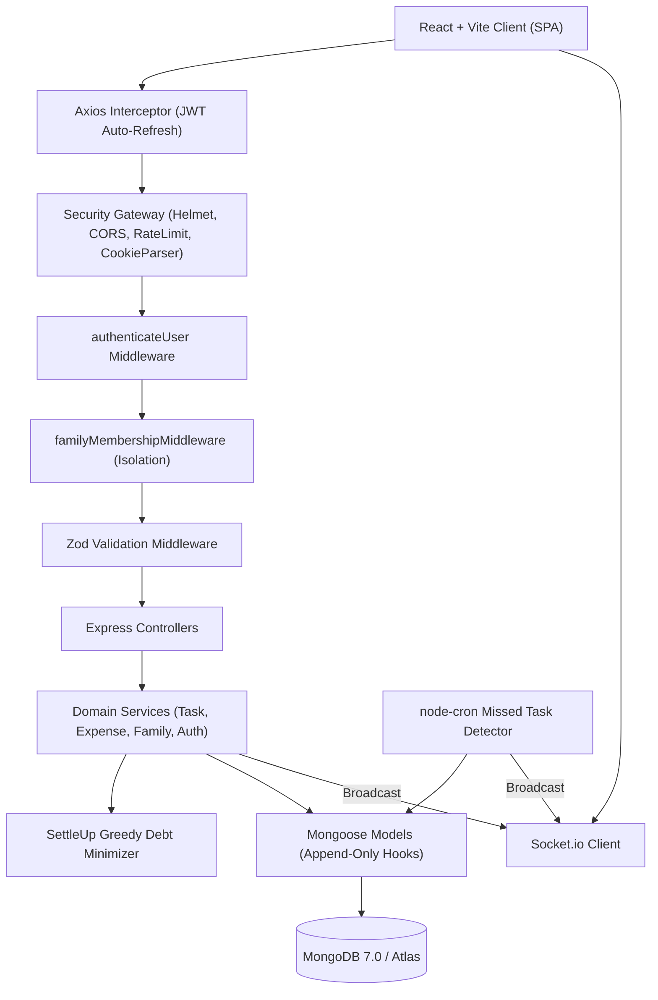

# SaathCare 🏥

> **Shared Elder-Care Coordination and Cost-Ledger Platform**  
> *Built for geographically distributed families caring jointly for an aging parent.*

[](https://github.com/your-username/saathcare/actions/workflows/ci.yml)
[](https://opensource.org/licenses/MIT)
[](https://nodejs.org/)
[](https://react.dev/)
[](https://www.mongodb.com/)
[](https://www.docker.com/)

---

## 1. Problem Statement

When siblings and relatives live across different cities or countries, caring for an elderly parent breaks down at two critical junctures:

1. **Asymmetric Care Burden**: Confusion over daily medications, blood sugar/BP readings, attendant management, and doctor appointments leads to dropped responsibilities, missed doses, and emotional friction.
2. **Financial Opacity**: Medical emergencies and monthly elder-care expenses (attendant salaries, diagnostic scans, prescription medicines) are managed over unorganized chat threads and spreadsheets, causing disputed splits and delayed settlements.

**The Core Principle of SaathCare**:
> **Shared accountability + transparent financial history.**

---

## 2. Key Features

- **Multi-Group Family Coordination**: Users can belong to multiple family groups. Care recipients are modeled directly within each care team.
- **Duty & Task Management**: Explicit duty assignment, due date countdowns, and tamper-proof task history.
- **Automated Missed-Task Detection**: A scheduled background job (`node-cron`) automatically detects overdue pending tasks and transitions them to `MISSED`, alerting connected family members.
- **Real-Time Live Sync (Socket.io)**: Live updates for duty completions, missed tasks, expense additions, and member join events without manual page refreshes.
- **Append-Only Immutable Expense Ledger**: Strict double-entry-inspired financial store where entries can never be modified or deleted. Corrections are recorded as reversing entries.
- **Paise Precision**: All currency math runs in integer paise (1 INR = 100 paise), eliminating IEEE 754 floating-point drift.
- **Greedy Debt-Minimization Settlement Engine**: Computes the minimum number of peer-to-peer bank/UPI transfers needed to square all debts in $O(N \log N)$ time.
- **Strict Family Boundary Security**: `familyMembershipMiddleware` ensures zero cross-tenant data leaks between family groups.
- **Enterprise Authentication & Token Hashing**: JWT access tokens, refresh token rotation, SHA-256 hashed verification and password reset tokens, and HTTP-only cookie security.
- **Financial Idempotency Middleware**: `X-Idempotency-Key` with MongoDB atomic reservations and 24-hour TTL caching, eliminating duplicate billing during network timeouts.
- **Decoupled Notification Outbox**: Transactional email dispatch with exponential backoff (`outboxWorker`), eliminating the dual-write problem and third-party latency.
- **Bill & Receipt Attachments**: Sandboxed file uploads with Multer, MIME whitelisting, and S3 pre-signed URLs without breaking ledger immutability.
- **Distributed Cron Locking**: Cluster-wide lease management (`DistributedLock`) preventing duplicate background jobs across multi-replica deployments.
- **Observability & Request Correlation**: `X-Request-Id` tracing, structured JSON access logging, and hierarchical error taxonomy.
- **GDPR-Compliant Account Deletion**: 3-day grace period with full PII anonymization while strictly preserving historical financial ledger integrity.
- **Progressive Web App (PWA)**: Offline service worker caching, network reconnect refetching, and WCAG-compliant $\ge 44\text{px}$ touch targets.

---

## 3. Technology Stack

### Frontend
- **Framework**: React 18 (Vite)
- **Routing**: React Router v6
- **HTTP Client**: Axios with automatic JWT refresh interceptor
- **Real-Time Client**: Socket.io-client
- **Styling**: Vanilla CSS Design System with CSS Custom Properties, glassmorphism, responsive grids, and micro-animations
- **Icons**: Lucide React

### Backend
- **Runtime**: Node.js (ES Modules)
- **Framework**: Express.js
- **Database**: MongoDB & Mongoose 8
- **Authentication**: JWT & bcryptjs (Work factor 12)
- **Validation**: Zod runtime schema validation
- **Real-Time Server**: Socket.io
- **Job Scheduler**: node-cron
- **Security**: Helmet, CORS whitelist, express-rate-limit, cookie-parser

### DevOps & Infrastructure
- **Containerization**: Docker & Multi-Stage Dockerfiles (Nginx Alpine + Node Alpine)
- **Orchestration**: Docker Compose
- **CI/CD**: GitHub Actions
- **Target Deployment**: Vercel (Client) + Render/Railway (Server) + MongoDB Atlas (Database)

---

## 4. Architecture Diagram



---

## 5. Monorepo Project Structure

```
saathcare/
├── .github/workflows/         # CI/CD pipelines (ci.yml, deploy.yml)
├── client/                    # React + Vite frontend
│   ├── src/
│   │   ├── components/        # Layout, modals, common UI components
│   │   ├── context/           # AuthContext, FamilyContext, SocketContext
│   │   ├── hooks/             # Custom React hooks
│   │   ├── pages/             # Landing, Login, Register, Dashboard, Tasks, Expenses, Settlements, Family
│   │   ├── routes/            # AppRoutes and ProtectedRoute
│   │   ├── services/          # API clients (auth, family, tasks, expenses)
│   │   ├── socket/            # Socket.io client manager
│   │   ├── utils/             # Currency (paise), dates, constants
│   │   ├── index.css          # Design system stylesheet
│   │   └── App.jsx
│   ├── vite.config.js
│   └── package.json
├── server/                    # Node.js Express backend
│   ├── src/
│   │   ├── config/            # Database, env loader, structured logger
│   │   ├── constants/         # Task statuses, split types, socket events
│   │   ├── controllers/       # Auth, Family, Task, Expense, Health controllers
│   │   ├── jobs/              # node-cron missed task detector
│   │   ├── middleware/        # Auth, family isolation, Zod validation, error handler
│   │   ├── models/            # User, FamilyGroup, Invite, Task, RotationRule, ExpenseLedger
│   │   ├── routes/            # API route definitions
│   │   ├── services/          # Auth, Family, Task, Expense, SettleUp services
│   │   ├── sockets/           # Socket.io server, auth, room emitter
│   │   ├── utils/             # ApiResponse, ApiError, crypto
│   │   └── validators/        # Zod input schemas
│   ├── tests/                 # Vitest unit and Supertest integration tests
│   └── package.json
├── docker/                    # Dockerfile.server, Dockerfile.client, nginx.conf
├── docs/                      # In-depth architectural & interview documentation
│   ├── architecture.md
│   ├── database.md
│   ├── api.md
│   ├── security.md
│   ├── testing.md
│   ├── deployment.md
│   └── interview-notes.md
├── docker-compose.yml         # Full local development stack
├── .env.example               # Configuration blueprint
└── README.md
```

---

## 6. Local Quickstart

### Prerequisites
- Node.js v18+ and npm
- Local MongoDB running at `mongodb://127.0.0.1:27017` (or MongoDB Atlas URI)

### Option A: Standard Local Setup

1. **Clone the repository**:
   ```bash
   git clone https://github.com/your-username/saathcare.git
   cd saathcare
   ```

2. **Configure Environment Variables**:
   Copy `.env.example` to `server/.env`:
   ```bash
   cp .env.example server/.env
   ```

3. **Install Dependencies**:
   ```bash
   npm run install:all
   ```

4. **Run Backend Test Suites**:
   ```bash
   npm test
   ```

5. **Start Development Servers**:
   ```bash
   # Terminal 1: Backend API & Socket Server (Port 5000)
   npm run dev:server

   # Terminal 2: Frontend Client (Port 5173)
   npm run dev:client
   ```

6. Open `http://localhost:5173` in your browser.

---

### Option B: Docker Compose (Zero-Config Stack)

Run MongoDB, the Node.js backend, and the Nginx-hosted client in isolated containers:
```bash
docker compose up -d --build
```
- Client: `http://localhost:3000`
- API & Sockets: `http://localhost:5000`
- Health Endpoint: `http://localhost:5000/health`

---

## 7. Running Tests

All unit tests and integration tests use **Vitest**:
```bash
cd server
npm test
```
The test suite covers:
- **Settlement Engine**: 2-member splits, 3-member splits, multi-creditor/debtor cases, custom splits, zero balances, remainder paise rounding, and reversal neutralizations.
- **Ledger Immutability**: Verifies database-level rejection of `updateOne`, `findOneAndUpdate`, and `deleteOne`.
- **Task State Machine**: Verifies forbidden transitions out of `COMPLETED` and `MISSED`.
- **Authentication**: JWT token verification, SHA-256 refresh token hashing, and Zod validator rejections.
- **Family Isolation**: Group authorization checks.
- **Health Checks**: Supertest assertions on `/health` and 404 handlers.

---

## 8. Architectural Documentation Directory

For deep-dive technical explanations and interview preparation, consult the `docs/` folder:

- [docs/architecture.md](file:///c:/SaathCare/docs/architecture.md) — Layered request flow, Socket.io rooms, cron jobs.
- [docs/database.md](file:///c:/SaathCare/docs/database.md) — Schema models, compound indexes, paise minor units, and immutability rules.
- [docs/api.md](file:///c:/SaathCare/docs/api.md) — Complete REST API endpoint reference and JSON envelopes.
- [docs/security.md](file:///c:/SaathCare/docs/security.md) — Threat mitigation matrix, token rotation, and family isolation guards.
- [docs/testing.md](file:///c:/SaathCare/docs/testing.md) — Test strategy, coverage criteria, and test matrix.
- [docs/deployment.md](file:///c:/SaathCare/docs/deployment.md) — Step-by-step production deployment for Render, Vercel, Atlas, and future AWS topology.
- [docs/production-hardening.md](file:///c:/SaathCare/docs/production-hardening.md) — Hardened subsystems, outbox patterns, idempotency, and security.
- [docs/website-addons.md](file:///c:/SaathCare/docs/website-addons.md) — Complete documentation of Website Add-ons & Product Enhancements (Phases 1–19).
- [docs/interview-notes.md](file:///c:/SaathCare/docs/interview-notes.md) — Senior software engineering interview questions (Q1–Q22) and design trade-offs.

---

## 9. License

This project is licensed under the MIT License — see the [LICENSE](LICENSE) file for details.
