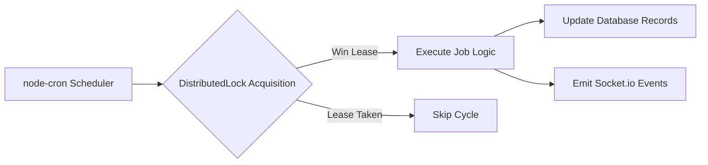

# SaathCare — System Architecture & Design

## 1. Overview & Clean Layered Design

SaathCare is architected around a **Clean Layered Architecture** that separates routing, perimeter security, request correlation, business logic, persistence, and real-time event broadcasting.

```
Incoming Request (HTTP / WebSocket)
        ↓
Perimeter Security & Tracking (Helmet, CORS, CookieParser, RateLimiter, RequestId, RequestLogger)
        ↓
Routes Layer (Express Modular Sub-Routers)
        ↓
Middleware Pipeline (authenticateUser, familyMembershipMiddleware, idempotency, upload, Zod validate)
        ↓
Controllers Layer (Thin orchestration adapters converting HTTP inputs to domain calls)
        ↓
Domain Services Layer (AuthService, FamilyService, TaskService, ExpenseService, SettleUpService, InAppNotificationService)
        ↓
Subsystem Abstractions (EmailProvider: Gmail/SMTP/Mock | StorageProvider: Local/S3 | OutboxWorker)
        ↓
Persistence Models Layer (Mongoose Schemas with Immutability & State Machine Hooks)
        ↓
Database Layer (MongoDB 7.0 / Atlas Replica Set)
```

---

## 2. Layer Responsibilities & Design Patterns

### 2.1 Perimeter & Gateway Layer
- **Request Tracing (`X-Request-Id`)**: Injected via `requestIdMiddleware.js`. Propagated to all logs and error envelopes for distributed tracing.
- **Structured JSON Logging**: `requestLogger.middleware.js` records method, URL, status, response time, and IP without leaking credentials.
- **Helmet**: Enforces HTTP security headers (`Content-Security-Policy`, `HSTS`, `X-Frame-Options`, `X-Content-Type-Options`).
- **CORS Whitelist with Credentials**: Supports cross-origin authenticated cookies (`SameSite=none`, `Secure=true`) for Vercel CDN $\to$ Render API.
- **Tiered Rate Limiting**:
  - Global API: 200 requests / 15 minutes.
  - Auth Routes (`/login`, `/register`, `/forgot-password`): 20 requests / 15 minutes.
  - Contact Inquiries: 5 requests / 15 minutes.

### 2.2 Middleware Pipeline Layer
- **`authenticateUser`**: Validates JWT access token from `Authorization: Bearer <token>` or HTTP-only cookies; attaches `req.user`.
- **`familyMembershipMiddleware`**: Verifies that `req.user._id` belongs to `FamilyGroup.members`. Rejects unauthorized cross-tenant attempts with `403 Forbidden`.
- **`idempotency({ required: false })`**: Atomically reserves `X-Idempotency-Key` in MongoDB; replays cached responses on duplicate network retries (`X-Cache: HIT`).
- **`receiptUpload`**: Multer filter validating 5MB max size and MIME whitelist (`image/jpeg`, `image/png`, `image/webp`, `application/pdf`).
- **`validate(schema, target)`**: Higher-order Zod schema validator stripping untrusted fields.
- **`errorHandler`**: Standardizes all operational exceptions into structured API envelopes.

### 2.3 Domain Services Layer
- **AuthService**: Handles registration, bcrypt password comparison (work factor 12), token signing, refresh token rotation, SHA-256 token hashing, and 3-day deletion scheduling.
- **FamilyService**: Manages family group profiles, care recipient vital details, and 64-character token invitation links.
- **TaskService**: Manages care duties, state transitions, and assignment queries.
- **ExpenseService**: Minor-unit integer paise math, split allocations, immutable ledger records, and reversal linkage.
- **SettleUpService**: Pure business logic calculating net balances and running the greedy debt-minimization algorithm in $O(N \log N)$ time.
- **InAppNotificationService**: Persists notifications and emits real-time user-targeted socket events.
- **ContactService**: Inbound inquiries, honeypot dropping, and database recording.

---

## 3. Real-Time Communication Architecture (Socket.io)

```
Client -> connect(auth: { token }) -> JWT Handshake Auth
Client -> emit('family:join', { familyGroupId }) -> Check DB Membership -> Join room `family:<familyGroupId>`
Backend Event Triggered -> socketEmitter.js -> Emits to `family:<familyGroupId>` or `user:<userId>`
All Connected Sibling Devices -> Live UI Updates without Page Refreshes
```

- **Handshake Verification**: Sockets must supply a valid JWT access token during connection; unauthenticated sockets are disconnected.
- **Room Isolation**:
  - `family:<familyGroupId>`: Receives `task:created`, `task:completed`, `task:missed`, `expense:added`, `expense:reversed`, and `member:joined`.
  - `user:<userId>`: Receives personal `notification:new` alerts for duty assignments and reminders.
- **Fallback Protocol**: Sockets auto-reconnect with exponential backoff. On reconnection, clients refetch authoritative state from REST endpoints.

---

## 4. Background Scheduled Workers & Distributed Locking



1. **Missed Task Sweeper (`missedTaskDetector.job.js`)**:
   - Runs every 5 minutes (`MISSED_TASK_CRON_SCHEDULE`).
   - Sweeps tasks with `status = PENDING` and `dueDate < NOW`.
   - Transitions tasks to `MISSED` and broadcasts `task:missed` to the family room.
2. **Notification Outbox Worker (`notificationOutbox.job.js`)**:
   - Runs every 10 seconds.
   - Fetches batches of `PENDING` / `FAILED` outbox records where `nextAttemptAt <= NOW`.
   - Dispatches via active `EmailProvider` with exponential backoff:
     $$\text{backoff} = \min(2^{\text{attempts}} \times 10\text{s}, 3600\text{s})$$
3. **Account Deletion Sweeper (`accountDeletion.job.js`)**:
   - Runs daily at midnight.
   - Anonymizes accounts past the 3-day grace period to `"Former Member"` while preserving financial ledger entries.
4. **Distributed Cron Locking (`DistributedLock`)**:
   - Atomic upsert with TTL index on `expiresAt` ensures only one instance in a multi-replica cluster executes scheduled jobs.

---

## 5. Storage & Email Subsystem Abstractions

- **Storage Provider Strategy**:
  - `LocalStorageProvider`: Saves uploaded bills in `server/uploads/` and streams files through `/api/expenses/receipts/:key`.
  - `S3StorageProvider`: Uploads to AWS S3 and vends time-limited signed URLs (`getSignedUrlPromise`).
- **Email Provider Strategy**:
  - `GmailEmailProvider`: Direct Gmail API OAuth2 transport with token refresh.
  - `SmtpEmailProvider`: Standard SMTP TLS transport for Mailtrap / Amazon SES / SendGrid.
  - `MockEmailProvider`: Console logger for local development and automated CI testing.
