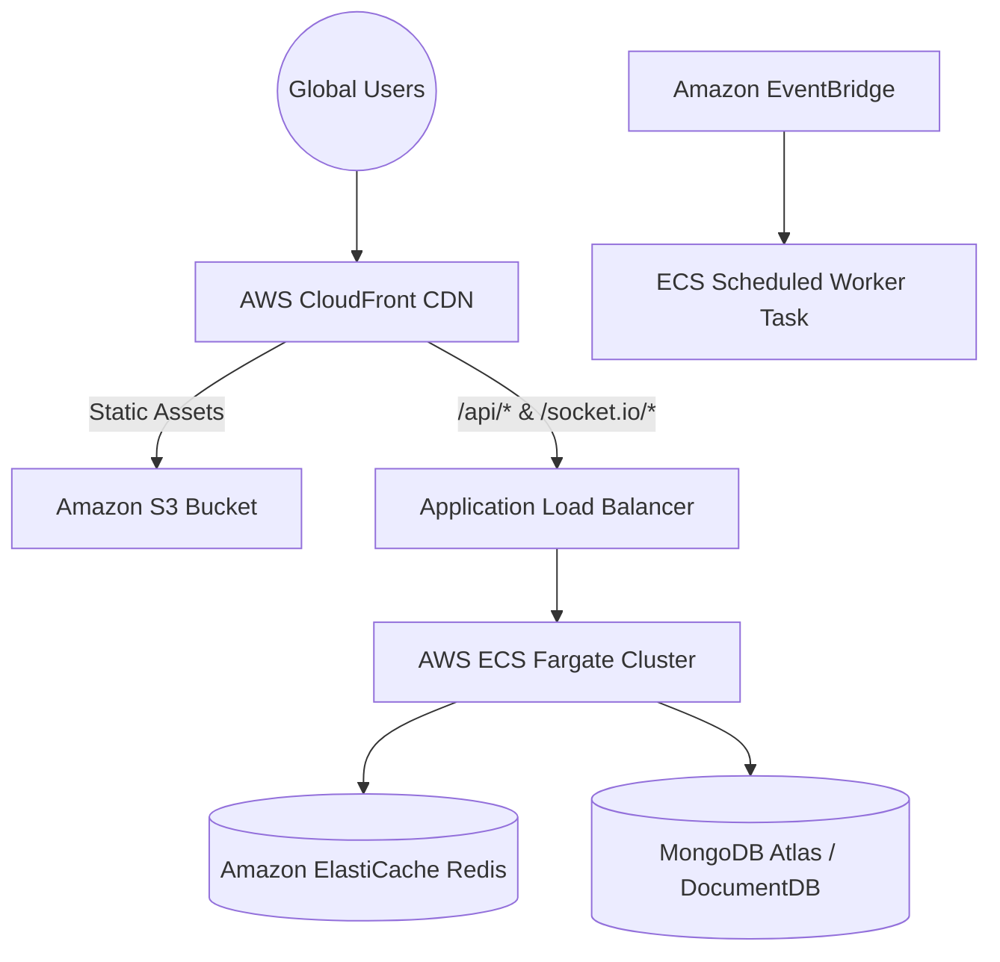

# SaathCare — Production Deployment & Cloud Infrastructure

## 1. Production Architecture Overview

SaathCare is configured for deployment across modern cloud platforms:

- **Frontend**: **Vercel** / **Netlify** (Vite Single Page Application on global CDN edge).
- **Backend**: **Render** / **Railway** (Docker container running Node.js with HTTPS & WebSocket support).
- **Database**: **MongoDB Atlas** (Managed replica set with automated backups).

---

## 2. Environment Variables Checklist

### Backend (`server/.env` / Cloud Dashboard):
```env
NODE_ENV=production
PORT=5000
CLIENT_URL=https://saathcare.vercel.app
MONGODB_URI=mongodb+srv://<user>:<password>@cluster0.mongodb.net/saathcare?retryWrites=true&w=majority
JWT_ACCESS_SECRET=<secure-random-64-char-string>
JWT_REFRESH_SECRET=<secure-random-64-char-string>
JWT_ACCESS_EXPIRY=15m
JWT_REFRESH_EXPIRY_DAYS=7
COOKIE_SECURE=true
COOKIE_SAME_SITE=strict
COOKIE_DOMAIN=.yourdomain.com
MISSED_TASK_CRON_SCHEDULE="*/5 * * * *"
MISSED_TASK_JOB_ENABLED=true
```

### Frontend (`client/.env.production`):
```env
VITE_API_URL=https://saathcare-api.onrender.com
```

---

## 3. Deployment Step-by-Step

### A. Database (MongoDB Atlas)
1. Create a free M0 or production M10 cluster on MongoDB Atlas.
2. In **Network Access**, whitelist your backend IP or `0.0.0.0/0` (with strong user credentials).
3. In **Database Access**, create a user with `readWrite` permissions.
4. Copy the connection string to `MONGODB_URI`.

### B. Backend (Render / Railway)
1. Connect your GitHub repository to Render or Railway.
2. Select **Web Service** with **Docker** runtime (using `docker/Dockerfile.server` or Node environment).
3. Set build command: `npm install` (or Docker build).
4. Set start command: `node src/server.js`.
5. Enter all environment variables.
6. Verify deployment by hitting `https://<your-backend-url>/health`.

### C. Frontend (Vercel)
1. Import repository on Vercel.
2. Root directory: `client`.
3. Framework preset: **Vite**.
4. Build command: `npm run build`.
5. Output directory: `dist`.
6. Add `VITE_API_URL` pointing to your deployed backend URL.

---

## 4. Local & VPS Deployment via Docker Compose

To run the complete production-like stack locally or on a Linux VPS:
```bash
# Clone repository
git clone https://github.com/your-username/saathcare.git
cd saathcare

# Start all 3 services (Client + API + MongoDB)
docker compose up -d --build

# View container logs
docker compose logs -f

# Verify containers are running
docker compose ps
```
Services will be accessible at:
- **Frontend**: `http://localhost:3000`
- **Backend API**: `http://localhost:5000`
- **Health Check**: `http://localhost:5000/health`
- **MongoDB**: `localhost:27017`

---

## 5. Future AWS Enterprise Topology (Target State)



### AWS Scaling Enhancements:
1. **Socket.io Horizontal Scaling**: Attach `@socket.io/redis-adapter` connected to **Amazon ElastiCache (Redis)**. This allows multiple ECS Fargate tasks to broadcast real-time events across nodes without connection sticky-session constraints.
2. **Distributed Job Locking**: Use Redis distributed locks (Redlock) or DynamoDB conditional leases so only one ECS task executes the missed-task detection cron.
